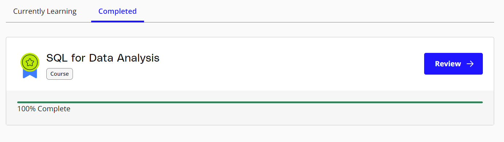

#Udacity Course: SQL for Data Analysis

## Course Description

The Udacity course "SQL for Data Analysis" is a comprehensive learning resource designed to equip learners with the fundamental skills required to use SQL (Structured Query Language) for data analysis. The course covers various SQL concepts, techniques, and best practices to effectively query and analyze data from relational databases.

Throughout the course, participants will gain hands-on experience working with real-world datasets and learn how to apply SQL queries to solve practical data analysis problems. The course content is structured in a logical and progressive manner, starting with the basics and gradually advancing to more complex SQL operations and functions.

## Course Syllabus

### 1. Introduction to SQL

* Overview of SQL and its importance in data analysis
* Introduction to relational databases and database management systems
*Writing basic SQL queries to retrieve and filter data
### 2. SQL Joins and Table Relationships

* Understanding table relationships: one-to-one, one-to-many, and many-to-many
* Performing inner joins, left joins, right joins, and full joins
* Using subqueries and derived tables to combine data from multiple tables

### 3. Aggregating Data with SQL

* Grouping data using GROUP BY and HAVING clauses
* Applying aggregate functions like SUM, AVG, COUNT, MIN, and MAX
* Using the ORDER BY clause to sort query results

### 4. Advanced SQL Concepts

* Working with complex queries using multiple joins and subqueries
* Utilizing SQL functions for string manipulation, date/time operations, and mathematical calculations
* Understanding window functions for advanced data analysis

### 5. Data Cleaning and Preparation with SQL

* Handling missing data and NULL values
* Performing data transformations and data cleansing operations
* Applying data validation and integrity checks using constraints

### 6. Putting It All Together: SQL for Data Analysis Projects

* Applying SQL skills to real-world data analysis projects
* Analyzing complex datasets and deriving insights using SQL queries
* Presenting and visualizing data analysis results

## Course Completion
Upon completing the "SQL for Data Analysis" course on Udacity, learners will have gained a solid foundation in SQL and the ability to leverage it for data analysis purposes. The course equips individuals with valuable skills that can be applied to various domains, including business analytics, data science, and database management.

